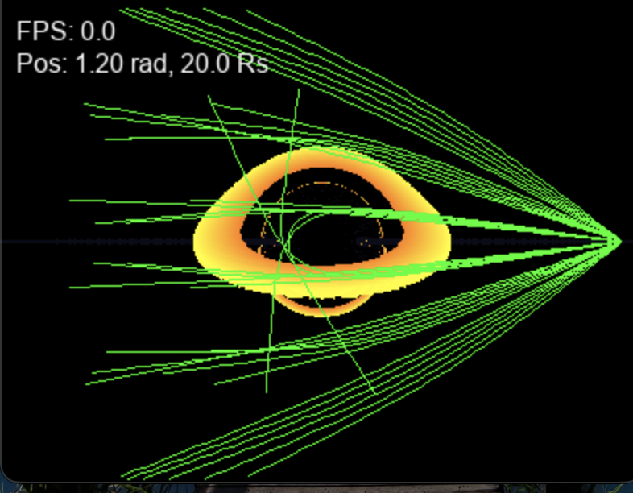

# Relativistic Black Hole Ray Tracer

Real-time Schwarzschild black hole simulation with gravitational lensing, accretion disk, and RK4 geodesic integration. Built with Python, Numba, and Pygame.

  

## Run
pip install pygame numba
python main.py

## Controls
W/S: elevation | A/D: rotation | Q/E: zoom

## Physics
Solves null geodesic equation in Schwarzschild metric. Uses RK4 integration and parallel CPU ray tracing via Numba @njit.